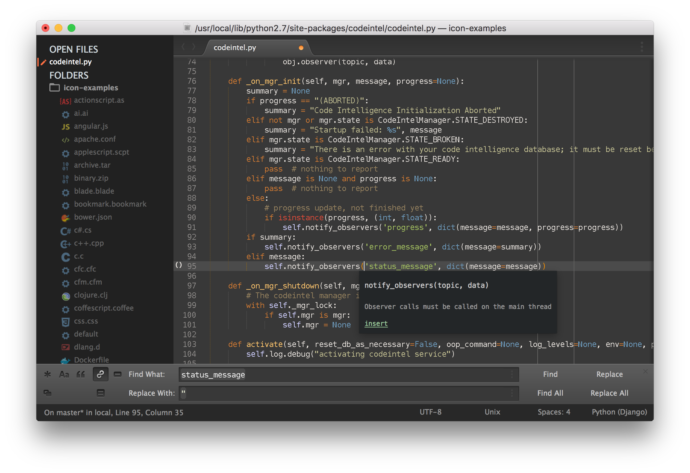
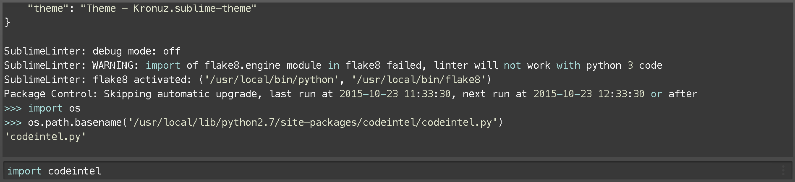

# Theme - Kronuz

Theme - Kronuz is a dark Theme for Sublime Text and also it is a syntax color scheme. The theme is based on [Soda Dark](https://github.com/buymeasoda/soda-theme) and the [Afterglow](https://github.com/YabataDesign/afterglow-theme) theme.

## Design & Colors

[View a larger screenshot](https://raw.githubusercontent.com/Kronuz/Kronuz-Theme/master/Screenshots/Kronuz-Theme.png)




### Highlighted console




*The font used in the screenshots is Menlo 12 with no antialias.


## Installation

### Package Control

The easiest way to install is using [Sublime Package Control](https://sublime.wbond.net/).

* Open `Command Palette` using menu item `Tools -> Command Palette...`, or <kbd>Cmd</kbd>+<kbd>Shift</kbd>+<kbd>P</kbd> (OS X) <kbd>Ctrl</kbd>+<kbd>Shift</kbd>+<kbd>P</kbd> (Win/Linux)
* Type `Package Control: Install Package`
* Search `Theme - Kronuz`


### Git Installation

Locate your Sublime Text `Packages directory` by using the menu item `Preferences -> Browse Packages...`.

Then, clone the repository using this command:

    git clone https://github.com/Kronuz/Kronuz-Theme/ "Theme - Kronuz"


### Manual installation

* Download the [GitHub .zip](https://github.com/Kronuz/Kronuz-Theme/archive/master.zip)
* Unzip the files and rename the folder to `Theme - Kronuz`
* Find your `Packages` directory using the menu item  `Preferences -> Browse Packages...`
* Copy the folder into your Sublime Text `Packages` directory.


## Activating the Theme

Activate this theme and color scheme by modifying your user preferences file, which you can find using the menu item `Sublime Text -> Preferences -> Settings - User`.

Then add the following code settings, depending on the theme you choose. **(After activating the theme, you must restart Sublime Text.)**

### Settings for Theme - Kronuz

```json
{
    "theme": "Theme - Kronuz.sublime-theme",
    "color_scheme": "Packages/Theme - Kronuz/Kronuz.tmTheme"
}
```

## Retina Resolution UI

Kronuz Theme supports retina display.
